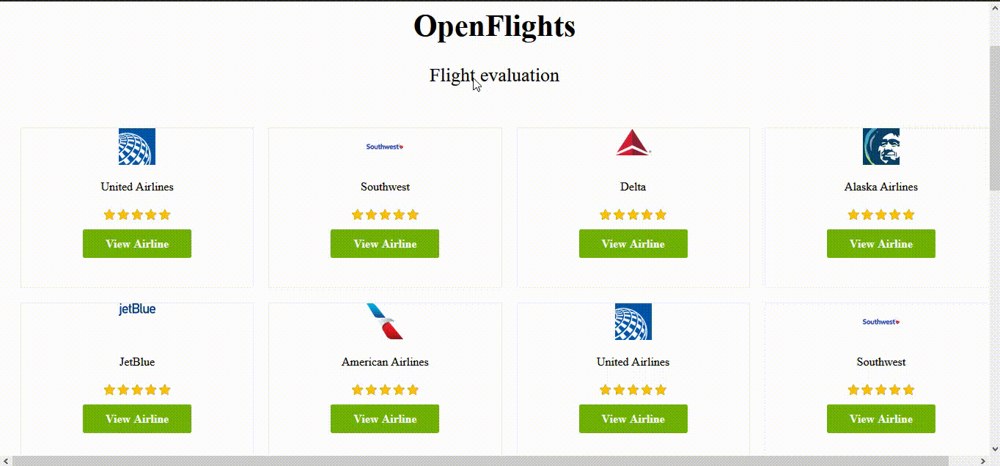

<h1 align="center">
  
</h1>

<p align="center">
  
  
   
  
  
  
  
  <a href="https://www.linkedin.com/in/bielvieira/">
        
    </a>
    <a href="mailto:gabrielvieira4102@gmail.com">
        
    </a>
    <a href="https://twitter.com/bielvieir4">
        
    </a>
</p>

<p align="center">
  <a href="#-about-the-project">About the project</a>&nbsp;&nbsp;&nbsp;|&nbsp;&nbsp;&nbsp;
  <a href="#-layout">Layout</a>&nbsp;&nbsp;&nbsp;|&nbsp;&nbsp;&nbsp;
  <a href="#-technologies">Technologies</a>&nbsp;&nbsp;&nbsp;|&nbsp;&nbsp;&nbsp;
  <a href="#-how-to-install">How to install</a>&nbsp;&nbsp;&nbsp;|&nbsp;&nbsp;&nbsp;
  <a href="#-how-to-contribute">How to contribute</a>&nbsp;&nbsp;&nbsp;|&nbsp;&nbsp;&nbsp;
  <a href="#memo-license">License</a>
</p>

## 💻 About the project

<strong>OpenFlights</strong> is project was created by <a href="https://medium.com/@zayneabraham">@zayneabraham</a> and used to analyze and study some basic concepts of Ruby on Rails and React.

The system manages evaluations of airlines. On the first screen, the user will be able to see the list of airlines with their respective assessments and by clicking on any company, they will be able to see the details of each assessment as well as evaluate it.

## 🔖 Layout

<h1 align="center">
    
</h1>

## 🚀 Technologies

This project was developed with the following technologies:

- [Ruby](https://www.ruby-lang.org/pt/)
- [Ruby on Rails](https://rubyonrails.org/)
- [React.js](https://pt-br.reactjs.org/)
- [Node.js](https://nodejs.org/en/)
- [Yarn](https://yarnpkg.com/)
- [VSCode](https://code.visualstudio.com/)
- [SQLite](https://www.sqlite.org/index.html)

## 🔥 How to install

```bash
# Clone this repository
$ git clone https://github.com/gabrielvieira1/OpenFlights.git

# Go into the repository folder and install dependencies
$ cd OpenFlights

# Run
$ yarn install

$ bundle install

$ bundle exec rails db:prepare

$ bundle exec rails s

$ rails server
```

## 🤔 How to contribute

- Make a fork;
- Create a branck with your feature: `git checkout -b my-feature`;
- Commit changes: `git commit -m 'feat: My new feature'`;
- Make a push to your branch: `git push origin my-feature`.

After merging your receipt request to done, you can delete a branch from yours.

## :memo: License
```
Copyright (c) 2020 zayneio

Permission is hereby granted, free of charge, to any person obtaining a copy
of this software and associated documentation files (the "Software"), to deal
in the Software without restriction, including without limitation the rights
to use, copy, modify, merge, publish, distribute, sublicense, and/or sell
copies of the Software, and to permit persons to whom the Software is
furnished to do so, subject to the following conditions:

The above copyright notice and this permission notice shall be included in all
copies or substantial portions of the Software.

THE SOFTWARE IS PROVIDED "AS IS", WITHOUT WARRANTY OF ANY KIND, EXPRESS OR
IMPLIED, INCLUDING BUT NOT LIMITED TO THE WARRANTIES OF MERCHANTABILITY,
FITNESS FOR A PARTICULAR PURPOSE AND NONINFRINGEMENT. IN NO EVENT SHALL THE
AUTHORS OR COPYRIGHT HOLDERS BE LIABLE FOR ANY CLAIM, DAMAGES OR OTHER
LIABILITY, WHETHER IN AN ACTION OF CONTRACT, TORT OR OTHERWISE, ARISING FROM,
OUT OF OR IN CONNECTION WITH THE SOFTWARE OR THE USE OR OTHER DEALINGS IN THE
SOFTWARE.
```
This project is under the MIT license. See the [LICENSE](LICENSE) for details.

Made with ♥ by Gabriel Vieira :wave: [Get in touch!](https://www.linkedin.com/in/bielvieira/)
